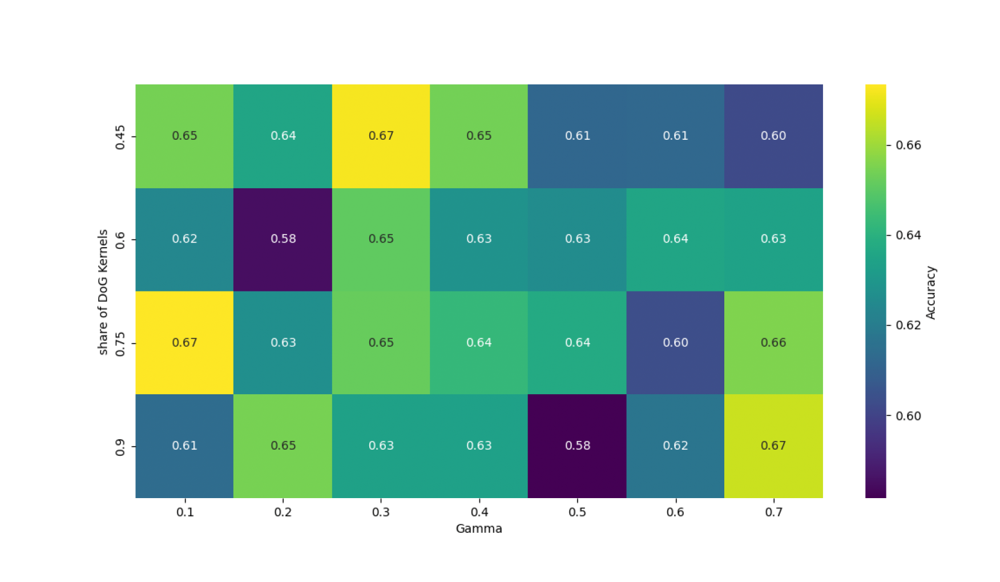
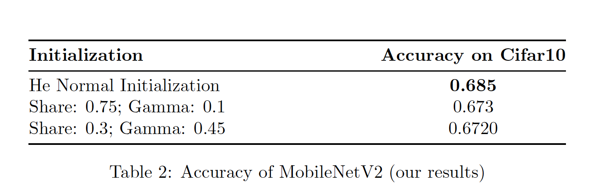
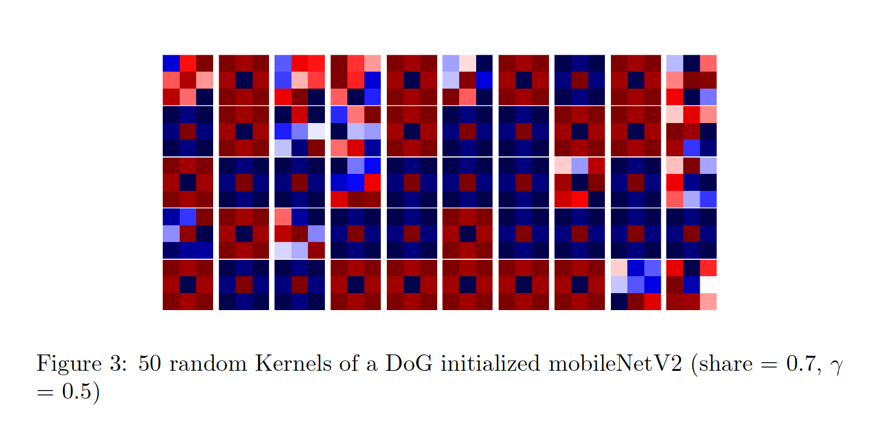
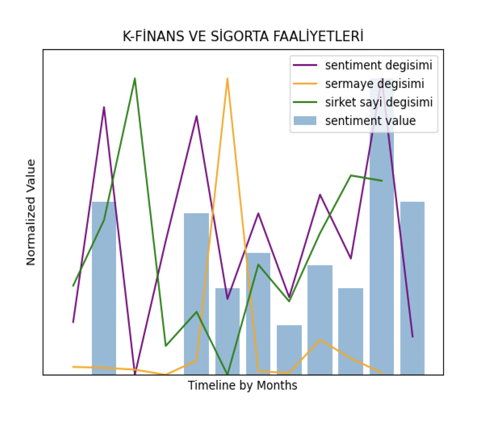

# Hello! It's Zehra

#### Technical Skills: Python, SQL, PowerBI

## Education			        		
- B.S., Management Information Systems | Boğaziçi University (Expected 2025)

## Work Experience
**Digitalization Intern @ Continental (June 2024 - October 2024)**
- Managed the development of the leasing module in the ERP system used by dealers and office teams
- Communicated with development team and stakeholders to address bottlenecks in digital systems
- Collaborated with development team to design and develop efficient automated systems to reduce cost and
increase operational efficiency

**Product Marketing Intern (_July 2023 - December 2023_)**
- Prepared and delivered weekly business review presentations, synthesizing key metrics and insights to support
informed decision-making processes
- Managed and optimized the CRM system to track and analyze customer interactions

## Projects
### CNN Performance Enhancement with Human-Inspired Initialization
The DoG initialization method utilizes the Difference of Gaussian function to initialize kernels in a way that mimics the human retinal system. Even when a regular initialization method is applied, some kernels are observed to evolve into a DoG-like shape. Thus, initializing some of the kernels with the DoG function increases accuracy, as concluded in Babaiee, Z., Kiasari, P. M., Rus, D., & Grosu, R. (2024). Unveiling the Unseen: Identifiable Clusters in Trained Depthwise Convolutional Kernels. arXiv preprint arXiv:2401.14469. As a future study, we aimed to achieve further enhancements by tuning two parameters: gamma and the ratio of initialized kernels within a layer. Due to limited computational resources, we operated this framework with the MobileNetV2 architecture, whereas the reference study used ConvNext Tiny, a much more complex model compared to MobileNetV2. Although MobileNetV2 may have been inadequate to increase performance, we had the opportunity to investigate whether this initialization method is generalizable to other models and datasets.
- Applied human-inspired kernel initialization method utilizing Difference of Gaussan function which extract low-level information such as edges and contrast. 
- During application, we tuned different combinations of DoG paarmeters to find a hyperparameter resulting in an
   enhanced performance.
The heatmap below shows the performance (accuracy) across different combinations of the `gamma` and `share` parameters:

## Results

### Hyperparameter Grid Search
The heatmap below shows the performance (accuracy) across different combinations of the `gamma` and `share` parameters:

### Accuracy Comparison
The table below highlights the accuracy achieved with He Normal Initialization compared to different configurations of DoG-initialized kernels:

### Visualization of Kernels
The following visualization displays 50 randomly initialized kernels with the DoG initialization method (Share = 0.7, Gamma = 0.5):

**Data Source**: [CIFAR-10 Dataset](https://www.cs.toronto.edu/~kriz/cifar.html)

### News Sentiment Analysis and Sectoral Dynamics

This study aims to explore the relationship between sentiment distilled from sector-related news articles and sectoral dynamics of seven sectors in Turkey using various NLP models. In addition to exploring this interplay, we also aim to analyze the robustness and performance of employed various models. We operated sentiment analysis utilizing six NLP models:BERT, RoBERTa, finBERT, Flair, Loughran-McDonald and TextBlob. Our results suggest that RoBERTa and Flair distilled the most meaningful sentiment scores closely aligning with sectoral dynamics on a monthly basis. Among the observed sectors, agriculture, forestry, and fishing is found to be the most sentiment-sensitive sector.

### IoT Cocktail Robot Project
- Developed a cocktail robot connected to a website, capable of making cocktails with a single click when ordered from the website.

